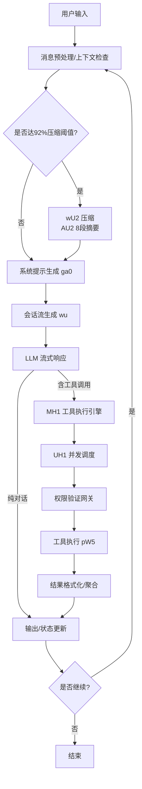
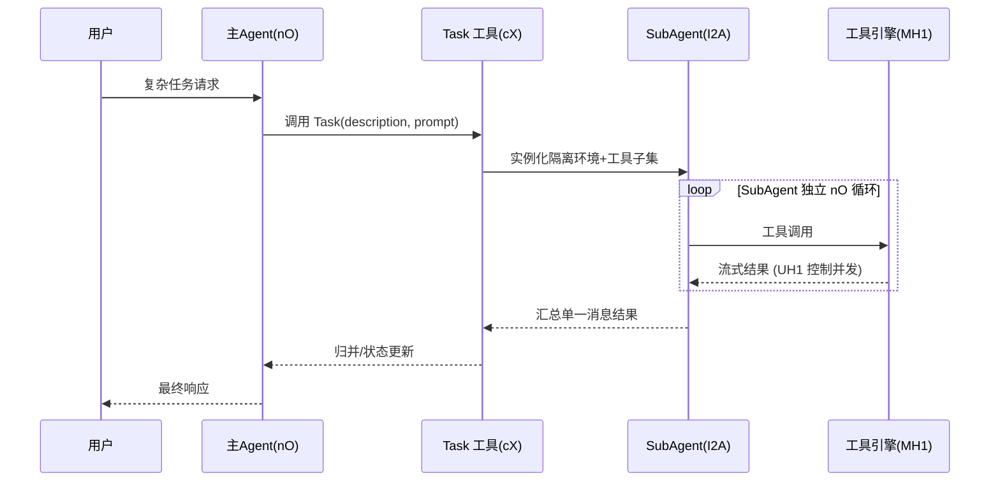

## Claude Code 复杂任务处理：模块工作流程说明

本文基于 `claude_code_v_1.0.33` 逆向分析成果与脚本工作流，梳理 Claude Code 在处理实际复杂任务时的核心模块与端到端工作流程，并配以 Mermaid 图示帮助理解。

### 模块与职责概览
- **Agent 主循环 (`nO`)**: 编排器。负责消息预处理、上下文压缩检查、系统提示生成、会话流驱动、工具调用分派与结果聚合。
- **消息队列 (`h2A`)**: 异步可中断消息通道。支持实时 steering、中断与恢复。
- **会话流生成 (`wu`)**: 将系统提示与上下文驱动 LLM 流式回复，处理增量 token、工具调用信号与中断。
- **上下文压缩 (`wU2` + `AU2`)**: 当使用率超阈值(92%)触发 8 段式结构化压缩，保持上下文连续性与节省 token。
- **系统提示生成 (`ga0`)**: 动态生成/拼装 System Prompt，注入工具能力、约束与状态提醒。
- **工具执行引擎 (`MH1`)**: 六阶段安全管道（发现→Schema验证→权限门控→取消/超时→执行→结果格式化）。
- **并发调度器 (`UH1`)**: 工具级并发控制（并发安全工具≤10；非并发安全工具串行），Promise.race 抢占式调度。
- **SubAgent 启动 (`I2A` via Task 工具)**: 为子任务实例化隔离 Agent 环境（独立循环/权限/工具子集），支持并发分析与执行。
- **记忆与持久化**: 短期 `messages[]`、中期 `compressed`、长期 `CLAUDE.md`，支持动态文件上下文注入与恢复。
- **安全与治理**: Zod 输入验证、权限三元组(allow/deny/ask)、沙箱/超时/资源限制、错误恢复与审计。
- **长期规划 (Todo)**: 任务分解、状态追踪、优先级/次序管理，贯穿多轮任务执行。

### 端到端主流程（复杂任务）


### 工具执行与并发调度流水线

- **并发规则**
  - **并发安全工具**: Read/LS/Glob/Grep/WebFetch/TodoRead/Task 等，最大并发 10（`gW5`）。
  - **非并发安全工具**: Write/Edit/MultiEdit/Bash/TodoWrite 等，串行执行并冲突检测。

### SubAgent（Task）协作模式


### 记忆管理与压缩触发
```mermaid
flowchart TD
  S[短期记忆 messages[]] -->|使用率评估| T{> 92%?}
  T -- 否 --> Keep[保持原上下文]
  T -- 是 --> AU2[8段式结构化压缩]
  AU2 --> M[中期记忆 compressed]
  M --> SP[系统提示生成/上下文注入]
  L[长期记忆 CLAUDE.md] --> SP
```
- **压缩策略**: 8 段摘要（背景/决策/工具/意图/结果/错误/未解/计划）保留因果链与执行脉络。
- **注入策略**: 文件内容按安全/容量策略注入，按相关度与优先级裁剪。

### 安全与边界处理（要点）
- **输入验证**: Zod Schema、类型/必填/格式化错误提示。
- **权限门控**: allow/deny/ask + Hook 覆盖；敏感操作需显式允许。
- **执行控制**: AbortController 中断、超时/资源限制、防卡死。
- **错误恢复**: 捕获/分类/重试/降级；工具级与循环级双层兜底。
- **审计记录**: 操作日志、安全事件与合规报表。

### 常量/阈值（关键）
- **压缩阈值**: `h11 = 0.92`
- **警告阈值**: `_W5 = 0.6`，**错误阈值**: `jW5 = 0.8`
- **并发限制**: `gW5 = 10`
- **最大输出**: `CU2 = 16384`

### 典型复杂任务落地（示例脉络）
- **大型重构**: 主 Agent 建模 → 并发 SubAgent 分析组件 → 结果合流 → MultiEdit 重构 → Bash 验证 → Todo 收敛与复盘；对话中多次触发 `wU2` 压缩保障连续性。
- **全栈开发**: 需求/Todo 规划 → 后端并发接口开发与测试 → 前端批量生成与接入 → 多次压缩与上下文注入 → 报告产出。

### 与脚本产物的关系（逆向视角）
- `scripts/split.js`/`beautify.js`/`learn-chunks.js`/`merge-again.js`/`improve-merged-chunks.js` 用于重构与标注原混淆代码，帮助定位如 `nO`/`wU2`/`MH1`/`UH1`/`I2A` 等核心路径；本文工作流与上述符号映射一致。

—— 完 ———